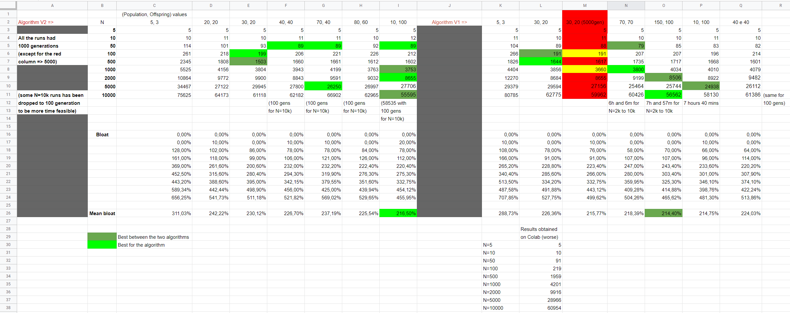

# Lab 2: Set Covering through a genetic algorithm

## Task
Given a number $N$ and some lists of integers $P = (L_0, L_1, L_2, ..., L_n)$ determine, if possible, $S = (L_{s_0}, L_{s_1}, L_{s_2}, ..., L_{s_n})$ such that each number between $0$ and $N-1$ appears in at least one list and that the total numbers of elements in all $L_{s_i}$ is minimum.

## Development

### 1. Prove that a solution exists

Through the analysis of the results obtained in the first lab, we know that a solution exists. We are committed in finding the optimal one with a wide problem space, focusing on performance with greater values of N (like 2000, 5000 and 10000). 

### 2. Find the Optimal Solution
We have two versions of the algorithm, in this repository there is the Version 1, and in the other teammates' repository there is the Version 2.\
In both cases, to find a good solution, we opted for a genetic algorithm where we represent each genome as a bitmap of 0's and only one "1" randomly chosen at the beginning to initialize the population. 

## Version 1
In each generation we take one of two possible paths: 
- the first, with a probability of 30%, in which we select a parent through a tournament of size 2 (tau), and then we mutate the winner parent to obtain the offspring;
- the second, with a probability of 70%, in which we select two parents through two different torunaments of size 2, and then we cross-over these two parents to obtain the offspring;

At the end of each generation we add the generated offsprings to the population, and then we cut off the worst genomes to return back to the initial population size, ready to face the next generation.\
The cross-over strategy we use composes the result picking a slice of random dimension from each of the parents, so it's a very basic one, but it still gives good results.\
The tournament is a basic tournament picking two parents at random inside the population and making them "fight" comparing their fitness.\
To determine the fitness of a potential solution we calculate the amount of covered numbers, and then we calculate the amount of collisions (duplicates) in the current solution.\
With each generation we try to maximize the covered numbers between 0 and N-1 at first, and then we try to minimize the amount of collisions (maximizing -collisions).\
To prevent elitarism we apply a double mutation (two "bit tilts") with a rate of 30% as cited before.\
With a reasonable time we achieve good results for very high values of N.

Comparing to lab1, we succedeed in calculating the solution for $N$'s bigger than 20 reaching N=10000 in a quite reasonable time (it strongly depends on number of generations, and population and offspring sizes).

Here is reported a table in which we report the weight results for different values of N, changing the population and offspring sizes, and comparing the Version 1 with the Version 2 of the algorithm, including also the bloatings and mean bloatings.

## Improvements
We are sure that some improvements in the logic of the genetic algorithm are possible, some improving ideas we had are only cited in comments directly in the code, but we are open to suggestions and critics about our versions.

## After deadline additions
I integrated in my code the new version of the problem generation function, provided by the Professor, that this time restores the initial state of the random generator instead of leaving the seed 42.\
Another thing is the CallCounter annotation (again provided by the Professor) to count the calls to the fitness function in order to get an idea of how heavy is the algorithm.

## Contributors

- [Marco Sacchet](https://github.com/saccuz)
- [Fabrizio Sulpizio](https://github.com/Xiusss)